# Setup Jenkins on OpenShift 3

1. From the IBM Cloud cluster dashboard, open the OpenShift web console,

    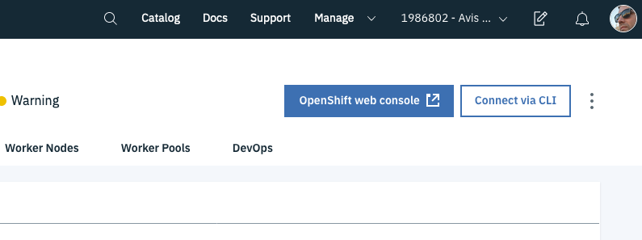

1. Go to the `Service Catalog`,
1. First we need to create a project named `jenkins` to deploy the Jenkins service to,
1. Click the + Create Project button, 
    1. For Name enter `jenkins`,
    1. For Desription enter Project for Jenkins,
    1. Click Create,

    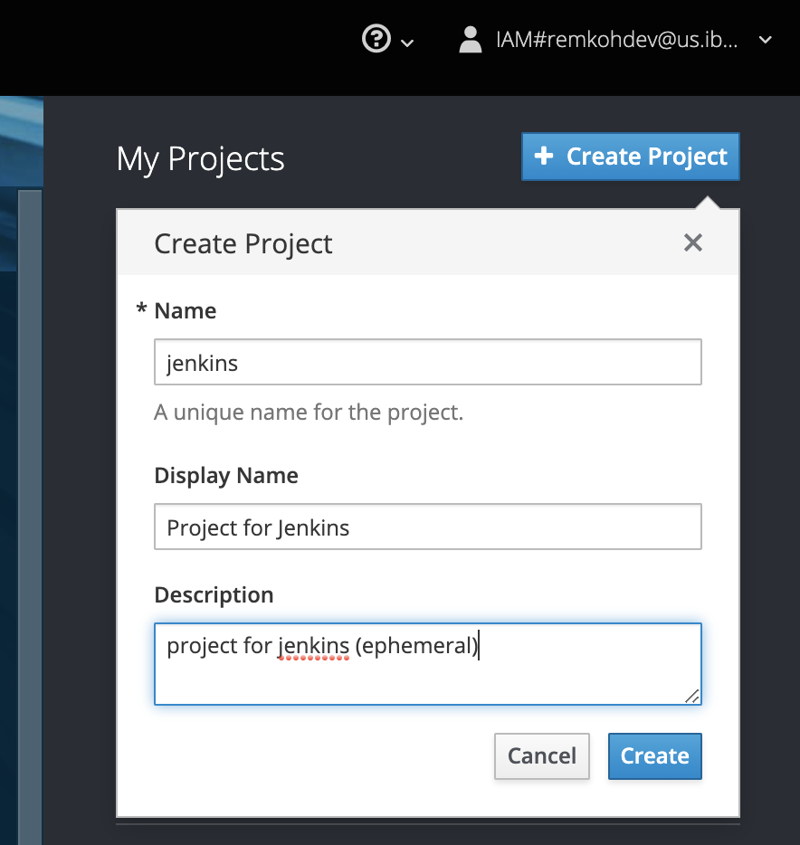

1. Or from the cloud shell,

    ```
    $ oc new-project jenkins
    Now using project "jenkins" on server "https://c107-e.us-south.containers.cloud.ibm.com:31608".
    ```

1. Go back to the Service Catalog,
1. Search the catalog for Jenkins (Ephemeral) or go to the `CD/CD` tab,
    1. Click the Jenkins (Ephemeral) service, note that the ephemeral version does not include persistent storage, so your data will be lost if the pod goes down, but for this tutorial it is easier to setup,

    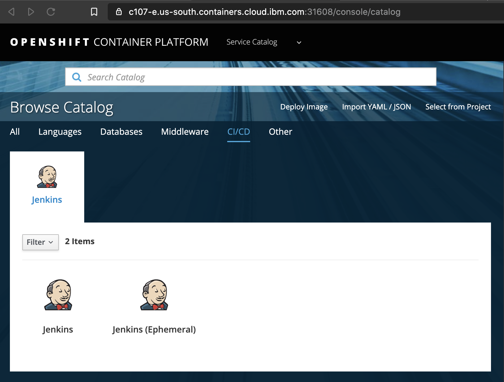

    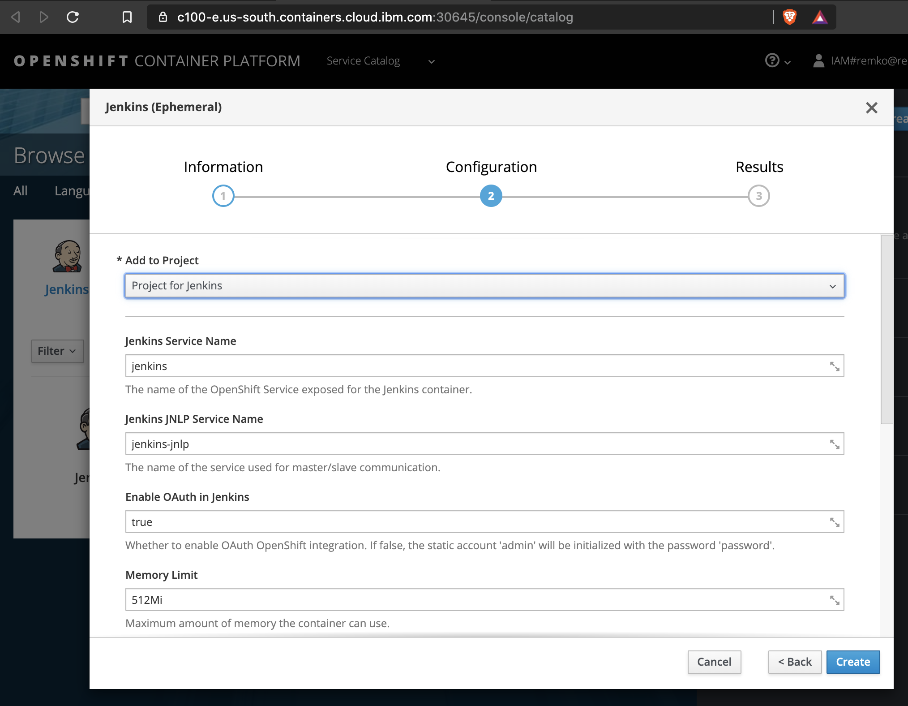

1. Click Next,
1. For Add to Project select `jenkins`,

    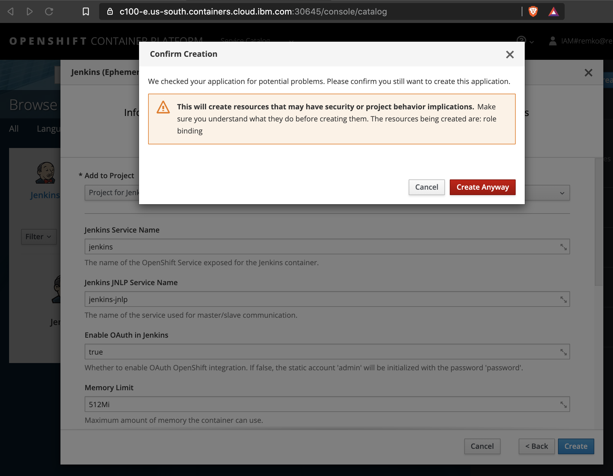

1. Click Next,
1. Check the option `Do not bind at this time`,

    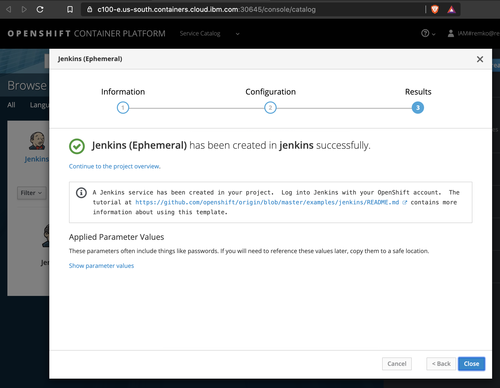

1. Click Create,

    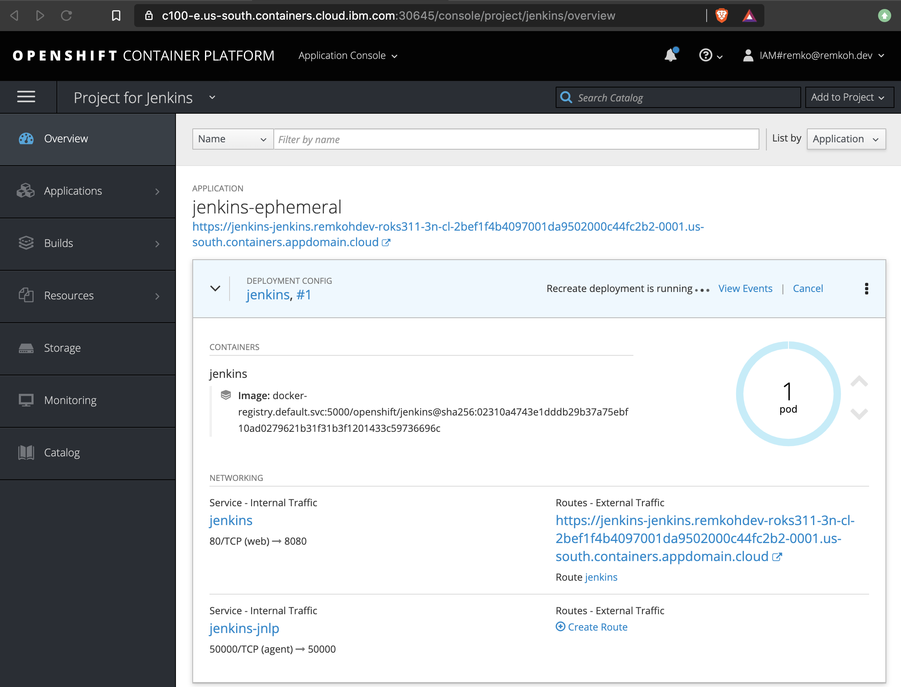

1. Click Close while Jenkins is being provisioned in `jenkins`,
1. Select the `Application Console`, and go to your project `jenkins`,
1. Go to Overview, and wait until Jenkins has been provisioned,
1. If provisioning fails the first time because of a timeout during pulling of images, simply deploy the service again,
1. To see the log for a deployment #1, go to Applications > Deployments > Jenkins > #1,
1. Click the Logs tab,

    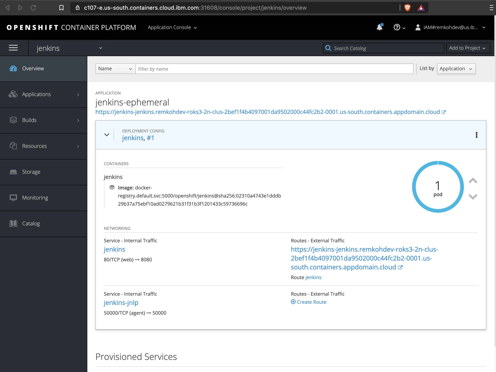

1. Or go to `Monitoring` to see a detailed status,

    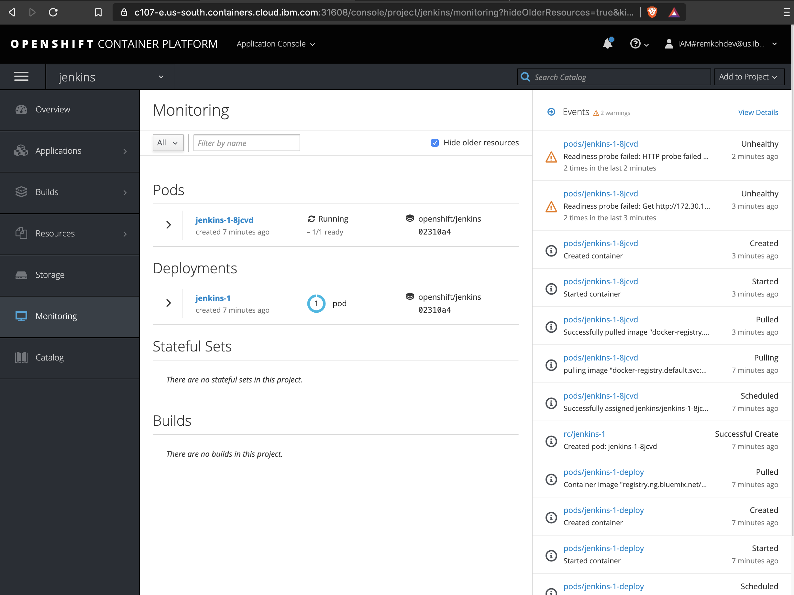

1. Open Jenkins in a new tab by clicking the Jenkins route URL in the `Overview`, e.g. https://jenkins-ci1.cda-openshift-cluster-1c0e8bfb1c68214cf875a9ca7dd1e060-0001.us-south.containers.appdomain.cloud,

1. Click Log in with OpenShift,

    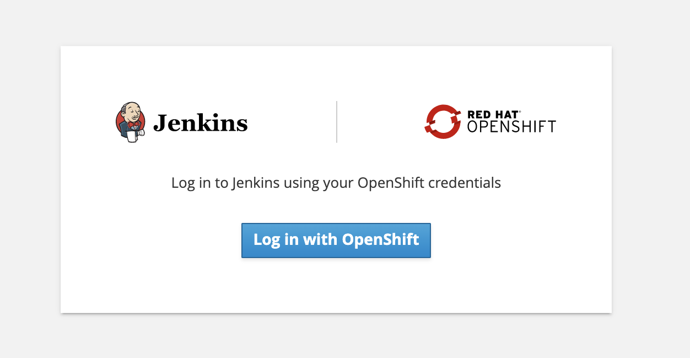

1. Click `Allow selected permissions`,

    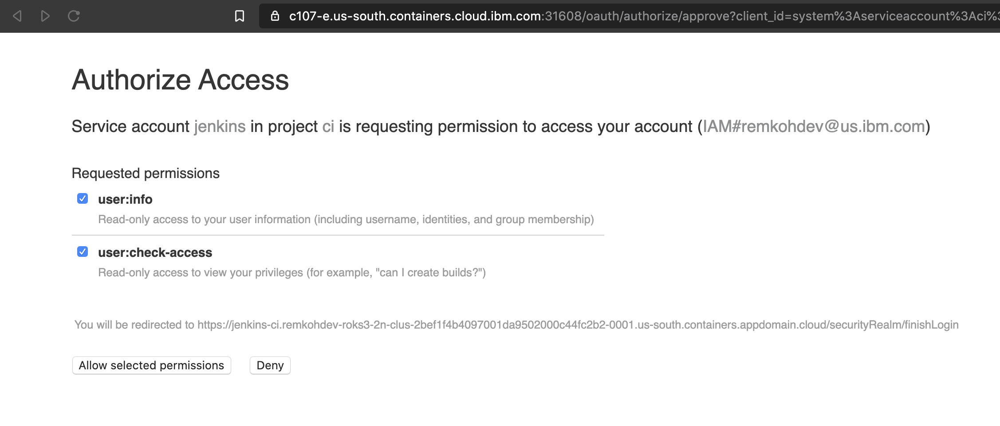

1. Jenkins web will open,
1. Configure Jenkins
    1. Go to Jenkins > Manage Jenkins > Global Tool Configuration,
    1. Go to the `Maven` section, 
    1. Click `Maven Installations`,
    1. If no Maven installer is configured, click `Add Maven`,
    1. Configure the `Name` to be `maven`, check the option `Install automatically` and select version `3.6.3`,
    1. Click Save,

    
